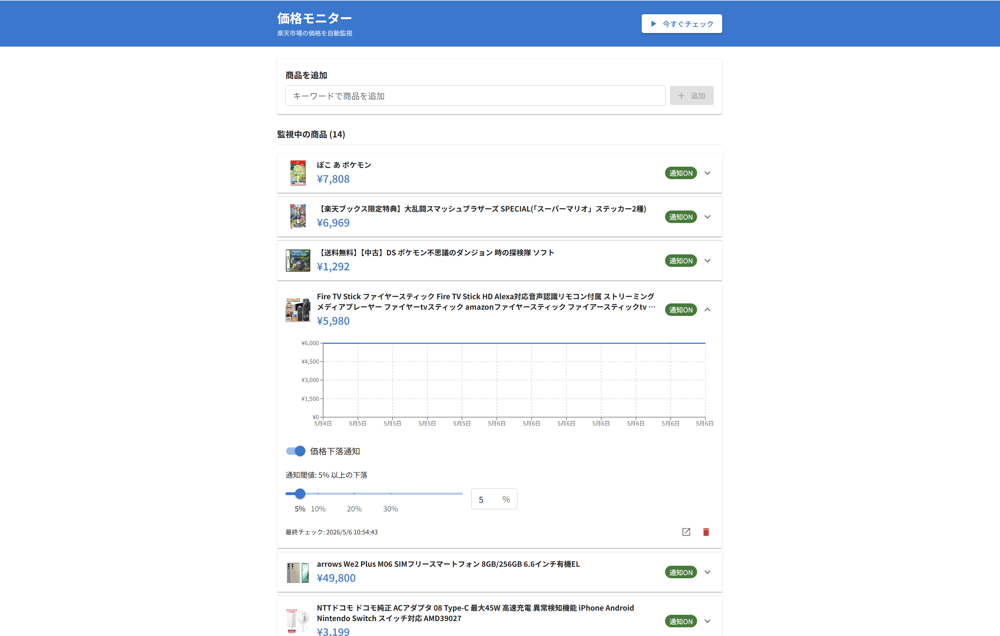
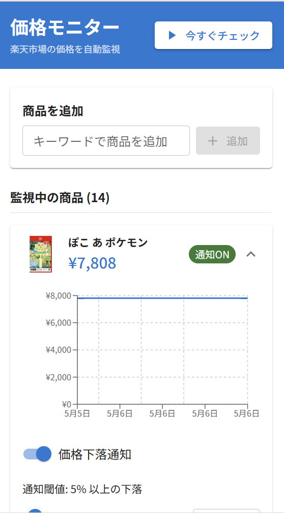
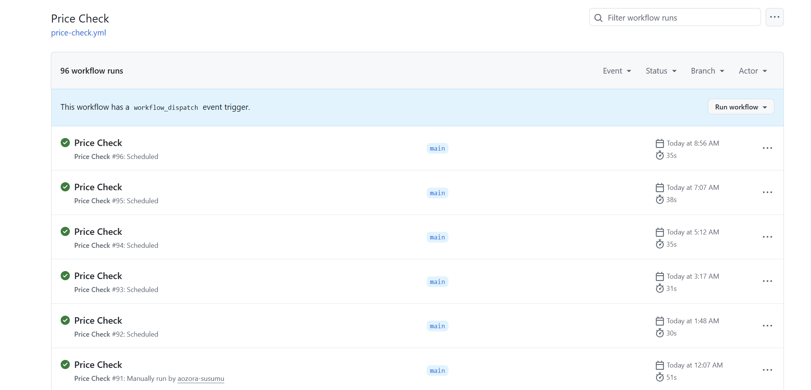

# 価格監視ツール

楽天市場の商品価格を定期監視し、値下がり時にメール通知するWebアプリです。

**フロントエンド（デモ）**: https://price-monitor-app.vercel.app/  
**バックエンド API**: https://price-monitor-backend-14rz.onrender.com/docs

## スクリーンショット

<!-- ▼ PC版アプリ画面（商品一覧・グラフ表示）-->



<!-- ▼ モバイル版アプリ画面 -->



※ モバイル画面は縦スクロール前提のUIです（スクリーンショットは上部の主要エリアを掲載）。

<!-- ▼ GitHub Actions の定期実行成功ログ -->



## 機能

- 楽天市場の商品URLを登録して価格を自動監視
- 商品ごとに値下がり通知しきい値（%）を個別設定
- 価格推移グラフの表示
- GitHub Actions による約1時間ごとの定期チェック
- 価格下落時に SendGrid 経由でメール通知

### 通知の仕様

- **「通知ON/OFF」は通知送信制御のみ** — 価格チェックと履歴更新は常に実行
- **通知送信失敗の耐性** — SendGrid 通信エラーが発生してもチェック結果は保存（監視ロジックに影響なし）
- **API バリデーション** — キーワード入力は1～100文字（前後空白は自動 trim）

## 技術スタック

| レイヤー       | 技術                                    |
| -------------- | --------------------------------------- |
| フロントエンド | React 19 / TypeScript / Vite / Recharts |
| バックエンド   | FastAPI (Python 3.12) / Pydantic v2     |
| データベース   | Supabase (PostgreSQL)                   |
| メール通知     | SendGrid                                |
| CI/定期実行    | GitHub Actions                          |
| ホスティング   | Vercel (frontend) / Render (backend)    |

## アーキテクチャ

```
[ブラウザ]
    │  REST API (HTTPS)
    ▼
[FastAPI on Render]
    ├── Supabase (PostgreSQL) - 商品・価格履歴の永続化
    ├── 楽天市場 API - 最新価格の取得
    └── SendGrid API - 値下がり通知メールの送信

[GitHub Actions] -- 毎時 cron --> [FastAPI /api/check-prices]
```

## ローカル開発

### 前提条件

- Python 3.12
- Node.js 20+
- Supabase プロジェクト（無料プランで可）
- 楽天 API キー
- SendGrid API キー（通知機能を使う場合）

### バックエンド

```bash
# 仮想環境の作成・有効化
python -m venv backend/.venv
backend/.venv/Scripts/activate  # Windows
# source backend/.venv/bin/activate  # Mac/Linux

# 依存パッケージのインストール
pip install -r backend/requirements.txt

# 環境変数ファイルの作成
copy backend\.env.example backend\.env  # Windows (cmd)
# cp backend/.env.example backend/.env   # Mac/Linux
# .env を編集して各値を設定

# Supabase に RPC 関数を適用
# backend/data/supabase_rpc.sql を Supabase SQL Editor で実行

# 開発サーバー起動
cd backend
uvicorn main:app --reload
```

### フロントエンド

```bash
cd frontend
npm install

# 環境変数ファイルの作成
echo VITE_API_BASE_URL=http://localhost:8000 > .env.local  # Windows (cmd)
# echo "VITE_API_BASE_URL=http://localhost:8000" > .env.local  # Mac/Linux

# 開発サーバー起動
npm run dev
```

## 環境変数

### バックエンド (`backend/.env`)

| 変数名                    | 説明                                                   |
| ------------------------- | ------------------------------------------------------ |
| `RAKUTEN_APP_ID`          | 楽天 API アプリ ID                                     |
| `RAKUTEN_ACCESS_KEY`      | 楽天 API アクセスキー                                  |
| `RAKUTEN_APP_URL`         | 本番デプロイ時のバックエンド URL                       |
| `SUPABASE_URL`            | Supabase プロジェクト URL                              |
| `SUPABASE_SECRET_API_KEY` | Supabase service_role キー                             |
| `CORS_ALLOW_ORIGINS`      | 許可するフロントエンド URL（カンマ区切りで複数指定可） |
| `SENDGRID_API_KEY`        | SendGrid API キー（通知機能を使う場合）                |
| `SENDGRID_FROM_EMAIL`     | 送信元メールアドレス                                   |
| `NOTIFY_TO_EMAIL`         | 通知先メールアドレス                                   |

### フロントエンド (`frontend/.env.local`)

| 変数名              | 説明               |
| ------------------- | ------------------ |
| `VITE_API_BASE_URL` | バックエンドの URL |

## API エンドポイント

| メソッド | パス                     | 説明                   |
| -------- | ------------------------ | ---------------------- |
| GET      | `/api/items`             | 監視商品の一覧取得     |
| POST     | `/api/items`             | 商品の新規登録         |
| PATCH    | `/api/items/{item_code}` | しきい値等の更新       |
| DELETE   | `/api/items/{item_code}` | 商品の削除             |
| POST     | `/api/check-now`         | 価格チェックの手動実行 |
| GET      | `/api/notifications`     | 通知ログの取得         |

ローカル起動後は http://localhost:8000/docs で Swagger UI を確認できます。

## テスト

```bash
cd backend
python -m pytest tests -q
```

**テスト カバレッジ（14個）**

- 価格チェック: 閾値判定、通知有無制御、楽観ロック競合対応
- 通知処理の堅牢性: SendGrid 通信例外時の継続処理、通知OFF時の価格更新継続
- ストレージ: RPC 戻り値の8パターン対応、パラメータ検証
- API バリデーション: キーワード入力の長さチェック（1～100文字）、空白チェック

## デプロイ

- フロントエンド: Vercel に `frontend/` をルートとして接続。`VITE_API_BASE_URL` にバックエンド URL を設定。
- バックエンド: Render に `backend/` をルートとして接続。上記環境変数をすべて設定。
- 定期実行: GitHub Actions の `price-check.yml` が UTC 毎時0分に自動実行（GitHub の負荷状況により若干遅延あり）。

## 既知の制約

- Render 無料プランはアイドル後の初回リクエストで Cold Start（約30秒）が発生します
- GitHub Actions の schedule は GitHub のサーバー負荷により最大数時間遅延する場合があります
- SendGrid Single Sender 認証のため、通知メールが迷惑メールフォルダに入る場合があります
- フロントエンド UI は PC 幅（Container maxWidth）を基準に最適化しています。モバイル表示は補助的なサポートです
